Dimension Reduction with Principal Components
================
Chase Baggett

Introduction
============

I will be expanding on my work in <https://github.com/cbagg/Penalized-Regression>.

There I evaluted best subset, lasso, and ridge regreession in the prediction of the strength of abdominal muscles. I willl repeat that work here to make it easier to read.

In the first project, we were trying to reduce the number of *P* predictors and identify the most important ones. In this exercise, we will be taking a different tactic. I noted when originally looking at this data, that many of our predictors are all measures of size and are collinear with age. In this exercise I will conceptually be thinking of these things as measures of an unknown latent variable. We will be combining them together in order to create a new predictor that adequately explains the underlying variation that is present.

Data
====

This data comes from a study of 25 patients aged 7-23 years with cystic fibrosis to determine the relationship between maximal expiratory pressure, a measure of the strength of the abdominal muscles and other expiratory muscles, and several other variables related largely to body size and lung function in these patients.

I will be breaking my data into 80% test, and 20% train sets randomly, so at the end we can compare the 5 models objectively.

``` r
set.seed(1)
train_idx <-
sample(
x = c(TRUE, FALSE),
size = nrow(cystfibr),
prob = c(.8, .2),
replace = T
)
train <- cystfibr[train_idx, ]
test <- cystfibr[!train_idx, ]

y_train = train$pemax
x_train = model.matrix(pemax ~ ., train)
y_test <- test$pemax
x_test <- model.matrix(pemax ~ ., test)
```

Analyses
========

Exploring the Data
------------------

Immediately, we see strong collinearity between height, age, and weight. This tells me the data likely included children. We also some correlation with our measures of the lungs, which seems to be expected. The collinearity here could make coefficient estimation difficult.

``` r
ggpairs(train)
```

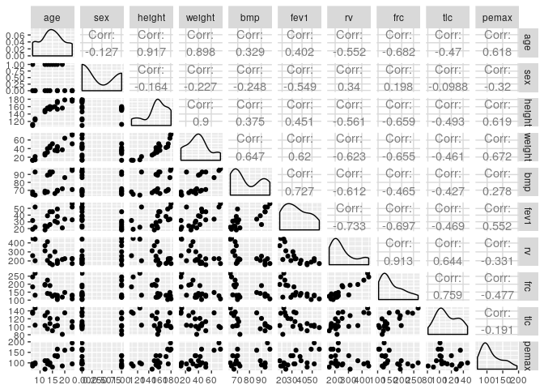

After a little digging, I discovered the real cause, which is seen below. The test is very non-random. They have males between 10 and 20 in the experiment, but females only in a much smaller age range. This could present a serious problem for test prediction because Sex will seem to describe many of the things that are collinear with age to some degree.

``` r
ggboxplot(data = train,x = "sex",y="age")
```

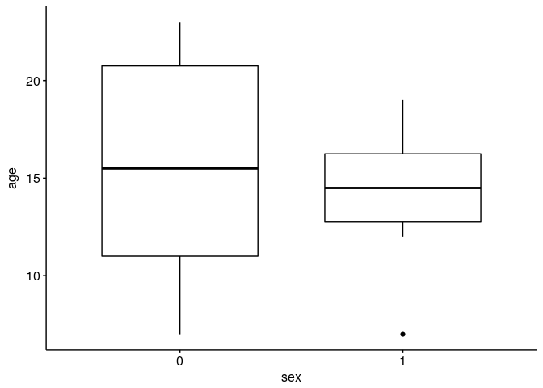

Correlation Plots
-----------------

Looking at correlation plots between pemax and our other predictors help us see the effect, we simply lack data at the high end of the spectrum for females.

``` r
cor_dat <- melt(train,id.vars = c("pemax","sex"))
ggplot(cor_dat,aes(y=pemax,x=as.numeric(value),color=factor(sex))) + 
  geom_point() + 
  geom_smooth(method="loess",se = F) + 
  facet_wrap(~variable,scales = "free") +
  xlab("Predictor")
```

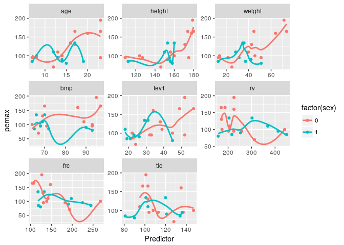

Best Subset Slection
--------------------

Best subsets is often computationally impractical, but with our small dataset and few predictors, it won't be a problem. It will help us identify the best set of predictors amongst the many we have.

First, we fit a best subsets model, and look at how RSS changes as the number of coefficients change. As we know to be true, RSS continues to decline as Predictors are added. BIC and Cp both provide optimum values with 4 predictors, despite Adjusted *R*<sup>2</sup> coninuing to grow until 7, which suggests that beyond 4 might be overfitting.

``` r
bestsubset.fit = regsubsets(pemax ~.,train)
bestsubset.summary = summary(bestsubset.fit)
bestsubset.overview <- data.frame(RSS=bestsubset.summary$rss,
                                  AdjR=bestsubset.summary$adjr2,
                                  Cp=bestsubset.summary$cp,
                                  BIC=bestsubset.summary$bic
                                  )

bestsubset.overview$Predictors <- 1:nrow(bestsubset.overview)
ggplot(melt(bestsubset.overview,id.vars = "Predictors"),aes(x=Predictors,y=value)) +
  geom_line() + 
  facet_wrap(~variable,scales = "free")
```

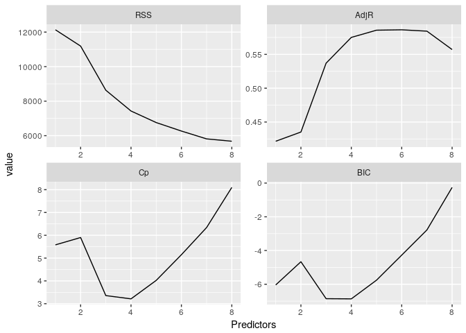

Here, we can see the best subset model with 4 variables includes weight,bmp,rv and fev1.

``` r
bestsubsets.models <- as.data.frame(bestsubset.summary$which)
datatable(bestsubsets.models)
```

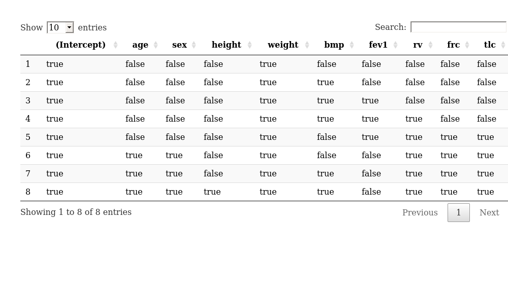

``` r
bestsubset.final_model <- lm(pemax ~ age + fev1 + tlc,data=train)
```

Here we can see an overview of the model's performance, including MSE.

``` r
bestsubsets.results <- glance(bestsubset.final_model)
bestsubsets.results$MSE <- mean(bestsubset.final_model$residuals^2)
bestsubsets.results[,c("MSE","adj.r.squared","df")]
```

    ##        MSE adj.r.squared df
    ## 1 497.2325     0.4667188  4

As well as the coefficients.

``` r
tidy(bestsubset.final_model)
```

    ##          term    estimate  std.error  statistic     p.value
    ## 1 (Intercept) -48.4420625 59.6388050 -0.8122574 0.428564174
    ## 2         age   3.8007751  1.2989397  2.9260597 0.009890915
    ## 3        fev1   1.2939149  0.5484738  2.3591189 0.031364441
    ## 4         tlc   0.5481412  0.3787159  1.4473677 0.167103483

Lasso Regression
----------------

Lasso regression is similar to best subsets in that it can be used to perform variable selection by using a lambda value to reduce coefficients to zero. We will compare its selection to that of bestsubsets. We will find the best value of lambda via cross validation.

We can see that the lasso method returned different variables. Our Lasso was built with cross-validation to pick the right value of *λ*, whereas our subset selection was built with the training set all at once.

With Lasso regression, we end up keeping many more of our coefficient in the model, with only a few being set to zero. Specifically, height, age, and sex were removed.

``` r
set.seed(1)
lasso.fit = glmnet(x_train,y_train,alpha=1)
lasso.cvfit = cv.glmnet(x_train,y_train,alpha=1)
lasso.coef = predict(lasso.fit,type = "coefficients",s = lasso.cvfit$lambda.min)
datatable(data.frame(name = lasso.coef@Dimnames[[1]][lasso.coef@i + 1], 
           coefficient = lasso.coef@x))
```

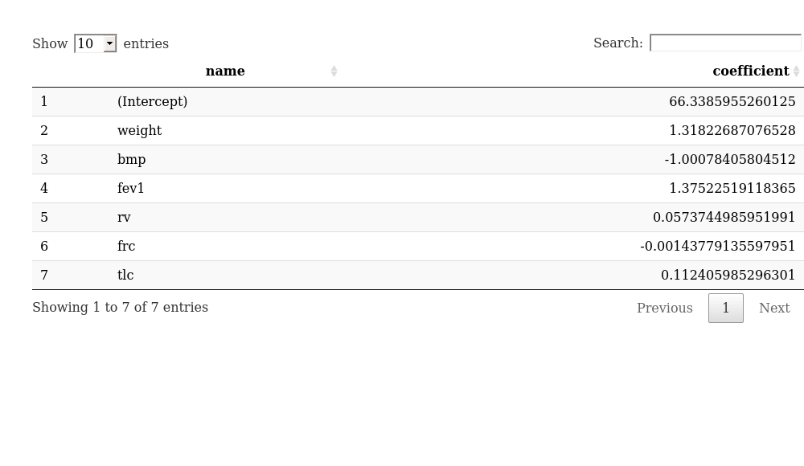 We can use the broom package to visualize the lambda we've chosen compared o other options, with the minimum lambda as a solid line, and one standard error lambda as a dashed line.

``` r
lasso.tidy <- tidy(lasso.cvfit)
lasso.glance <- glance(lasso.cvfit)
ggplot(lasso.tidy, aes(lambda, estimate)) + geom_line(color = "red") +
    geom_ribbon(aes(ymin = conf.low, ymax = conf.high), alpha = .2) +
    scale_x_log10() +
    geom_vline(xintercept = lasso.glance$lambda.min) +
    geom_vline(xintercept = lasso.glance$lambda.1se, lty = 2)
```

 And the MSE on the training set is worse than with best subset.

``` r
mean((predict(lasso.fit,newx=x_train) - train$pemax)^2)
```

    ## [1] 425.6996

Ridge Regression
----------------

Unlike lasso and best subset, ridge regression cannot be used for outright variable selection on its own, as the ridge will reduce the coefficients near sometimes, but never actually to zero. Ridge should be expected to be more logical for designed experiments where there is a strong first principle reason to believe most of the predictors have an effect on the response.

We will fit a ridge regression to the training set and compare it to lasso and best subset. We will see that every variable remains in the model. In fact, sex, which was dropped by both of the other models, ends up with the largest coefficient by absolute value.

``` r
set.seed(1)
ridge.fit = glmnet(x_train,y_train,alpha=0)
ridge.cvfit=cv.glmnet(x_train,y_train,alpha=0)
ridge.coef = coef(ridge.fit,s=ridge.cvfit$lambda.min)
datatable(data.frame(name = ridge.coef@Dimnames[[1]][ridge.coef@i + 1], 
           coefficient = ridge.coef@x))
```

 We will also visualize the lambda selection for ridge regression.

``` r
ridge.tidy <- tidy(ridge.cvfit)
ridge.glance <- glance(ridge.cvfit)
ggplot(ridge.tidy, aes(lambda, estimate)) + geom_line(color = "red") +
    geom_ribbon(aes(ymin = conf.low, ymax = conf.high), alpha = .2) +
    scale_x_log10() +
    geom_vline(xintercept = ridge.glance$lambda.min) +
    geom_vline(xintercept = ridge.glance$lambda.1se, lty = 2)
```

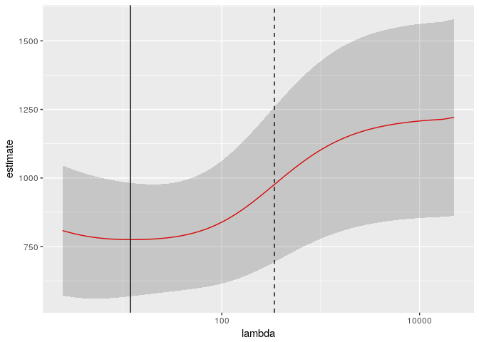

The MSE on the training set for ridge regression is consideribly worse than for both lasso and best subsets.

``` r
mean((predict(ridge.fit,newx=x_train) - train$pemax)^2)
```

    ## [1] 771.4111

Principal Components Regression
-------------------------------

While our previous methods assumed that only some of our variables were important, principal components regression assumes that some of them measure the same underlying feature set. In this dataset, this is a very logical thought because of how many of our predictors are collinear, and are derrived from various measures of health and size.

When we fit a PCR model to our data, and cross-validate it, we find that our best outcome is at M=3. This means that we can condense most of the information in these 9 variables down into 3 dimensions.

``` r
set.seed(1)
pcr.fit <- pcr(pemax~.,data=train,scale=T,validation="CV")
validationplot(pcr.fit,val.type="MSEP")
```

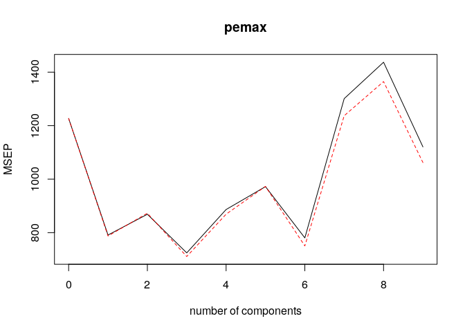

``` r
pcr.fit <- pcr(pemax~.,data=train,scale=T,ncomp=3)
```

Then we can predict on our training set and get an MSE. Best subset still has the best MSE on the training set we've found so far.

``` r
mean((predict(pcr.fit,ncomp = 3)-train$pemax)^2)
```

    ## [1] 554.086

Partial Least Squares
---------------------

Partial least squares provides us with a supervised alternative to partial components. Rather than fitting for maximum variability, Partial Least Squares looks to describe the response.

``` r
set.seed(1)
pls.fit <- plsr(pemax~.,data=train,scale=TRUE,validation="CV")
validationplot(pls.fit,val.type="MSEP")
```

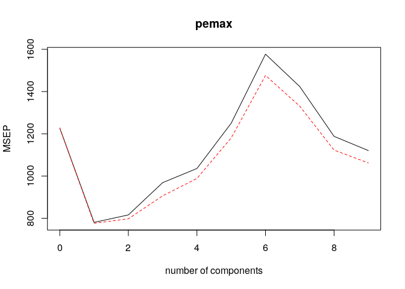

``` r
pls.fit <- plsr(pemax~.,data=train,scale=TRUE,ncomp=1)
```

``` r
mean((predict(pls.fit,ncomp = 1) - train$pemax)^2)
```

    ## [1] 649.0581

Blended Model
-------------

Having looked at the data, I believe there are two distinct underlying factors here. First, there is the age and sex of the patient, as well as their overall health. These are represent by the variables age, sex, height, weight, and bmp (body mass).

``` r
set.seed(1)
blended.agefit <- pcr(pemax~ sex*(age + height + weight),data=train,scale=T,validation="CV")
validationplot(blended.agefit,val.type="MSEP")
```

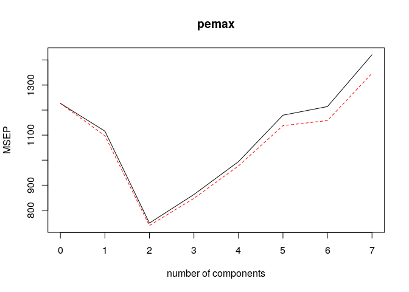

``` r
blended.agefit <- pcr(pemax~ sex + age + height + weight,data=train,scale=T,ncomp=2)
train$AgeIndex <- as.numeric(predict(blended.agefit,ncomp = 2))
test$AgeIndex <- as.numeric(predict(blended.agefit,ncomp = 2,newdata = test))
```

Secondarily, there are measures of lung capacity, rv, frc, and tlc. However, all 3 of these provide value under cross-validation.

``` r
set.seed(1)
blended.lungfit <- pcr(pemax~ fev1 + rv + frc + tlc,data=train,scale=T,validation="CV")
validationplot(blended.lungfit,val.type="MSEP")
```

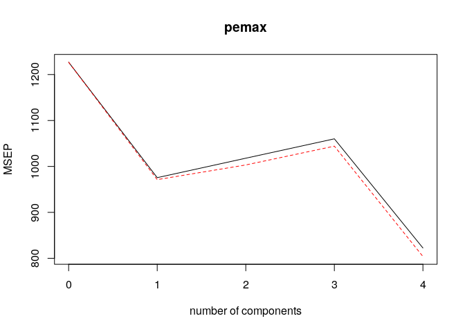

Then I create a blended model which interacts our AgeIndex with each of our 4 measures of lung capacity. This is largely a hypothetical model built by examining what the variables are and imagining how they seem to interract.

``` r
blended.fit <- lm(pemax ~ AgeIndex * (fev1 + rv + tlc + frc),data=train)
blended.fit <- step(blended.fit,direction="both" ,trace=F)
mean(blended.fit$residuals^2)
```

    ## [1] 285.7324

Conclusion
==========

Test Set Validation
-------------------

Now, I am going to take each of the 3 models and test them against our test set. Our test set is pretty much tiny because we are working with so little data to begin with, but it is a good exercise. We, in fact, only have 5 records.

These are our actual predictions on the test set.

``` r
test$BestSubset <- predict(bestsubset.final_model,newdata = test) - test$pemax
test$Lasso <- as.numeric(predict(lasso.fit,newx = x_test,s = lasso.cvfit$lambda.min)) - test$pemax
test$Ridge <- as.numeric(predict(ridge.fit,newx = x_test,s = ridge.cvfit$lambda.min)) - test$pemax
test$PLS <- as.numeric(predict(pls.fit,newdata = test,ncomp = 1) - test$pemax)
test$PCR <- as.numeric(predict(pcr.fit,newdata = test,ncomp = 3) - test$pemax)
test$Ensemble <- predict(blended.fit,newdata = test) - test$pemax

results <- test[,c("BestSubset","Lasso","Ridge","PLS","PCR","Ensemble")]
results_m <- melt(results,id.vars=NULL)
summarise(group_by(results_m,variable),MSE=mean(value^2))
```

    ## # A tibble: 6 x 2
    ##   variable     MSE
    ##   <fct>      <dbl>
    ## 1 BestSubset   750
    ## 2 Lasso        700
    ## 3 Ridge        763
    ## 4 PLS          879
    ## 5 PCR          790
    ## 6 Ensemble     909

Cross-Validation
----------------

Because of how little data I had to begin with, I am very worried that my train and test sets aren't very random. When you have only a handful of records in your test set, an outlier sneaking in can be damaging to model selection.

So What I've done is I've taken the saved final model of each method and simulated the train/test process with 100 different seeds. At each seed, it will pick a new best subset model based on that 80% of the data, as well as new Lasso, Ridge, PLS and PCR models based on cross-validation within the training set for the selection of lambdas and ncomp.

We will learn two things from this. First, we will learn which model has the lowest MSE the most often, but we will also learn alot about the stabiltiy of our models. The narrow the distribution the more stable, and the furthest left the most accurate.

The best subset model is the most interesting result, because its MSE is bimodal, which suggests there are two or more underlying models that are flipping around based on which of the records gets sampled.

Ridge regression, on the other hand, appears to be the most stable model, predicting within a narrow range of accuracy the most often.

The ensemble model I built, which uses backwards and forwards selection on a PCR that uses Age, Weight, Sex, and Height-- our highly collinear predictors, seems to be the most accurate, but also the most unstable. It has the widest curve, regularly predicting in a wide range of areas, though it has, overall, the best predictive accuracy.

``` r
tr_idx <- rep(TRUE, ceiling(nrow(cystfibr) * .9))
te_idx <- rep(FALSE, floor(nrow(cystfibr) * .1))
t_idx <- c(tr_idx, te_idx)

cv_cystfibr <- function(seed) {
  set.seed(seed)
  train_idx <- sample(x = t_idx,
                      size = nrow(cystfibr),
                      replace = F)
  train <- cystfibr[train_idx, ]
  test <- cystfibr[!train_idx, ]
  
  y_train = train$pemax
  x_train = model.matrix(pemax ~ ., train)
  y_test <- test$pemax
  x_test <- model.matrix(pemax ~ ., test)
  
  ##Best Subset
  bestsubset.fit = regsubsets(pemax ~ ., train)
  best_model <-
    match(min(summary(bestsubset.fit)$bic), summary(bestsubset.fit)$bic)
  
  model <- bestsubset.summary$which[best_model, -1]
  names <- names(model)
  preds <- names[model]
  form <- paste(preds, "", collapse = " + ")
  formula <- as.formula(paste("pemax ~ ", form, sep = ""))
  bestsubset.final_model <- lm(formula, data = train)
  
  
  ##Lasso
  lasso.fit = glmnet(x_train, y_train, alpha = 1)
  lasso.cvfit = cv.glmnet(x_train, y_train, alpha = 1)
  
  ##Ridge
  ridge.fit = glmnet(x_train, y_train, alpha = 0)
  ridge.cvfit = cv.glmnet(x_train, y_train, alpha = 0)
  
  ##PCR
  pcr.fit <- pcr(pemax ~ .,
                 data = train,
                 scale = T,
                 validation = "CV")
  pcr_M <- match(min(as.numeric(pcr.fit$validation$PRESS)),
                 as.numeric(pcr.fit$validation$PRESS))
  pcr.fit <- pcr(pemax ~ .,
                 data = train,
                 scale = T,
                 ncomp = pcr_M)
  
  ##PLS
  pls.fit <- plsr(pemax ~ .,
                  data = train,
                  scale = TRUE,
                  validation = "CV")
  pls_M <- match(min(as.numeric(pls.fit$validation$PRESS)),
                 as.numeric(pls.fit$validation$PRESS))
  pls.fit <- plsr(pemax ~ .,
                  data = train,
                  scale = TRUE,
                  ncomp = pls_M)
  
  
  ##Blended
  blended.agefit <-
    pcr(
      pemax ~ sex + age + height + weight,
      data = train,
      scale = T,
      validation = "CV"
    )
  age_M <- match(min(as.numeric(blended.agefit$validation$PRESS)),
                 as.numeric(blended.agefit$validation$PRESS))
  blended.agefit <- pcr(
    pemax ~ sex + age + height + weight,
    data = train,
    scale = T,
    ncomp = age_M
  )
  
  train$AgeIndex <- as.numeric(predict(blended.agefit, ncomp = age_M))
  test$AgeIndex <-
    as.numeric(predict(blended.agefit, ncomp = age_M, newdata = test))
  blended.fit <-
    lm(pemax ~ AgeIndex * (fev1 + rv + tlc + frc), data = train)
  blended.fit <- step(blended.fit, direction = "both" , trace = F)
  
  ##Aggregate
  test$BestSubset <-
    predict(bestsubset.final_model, newdata = test) - test$pemax
  test$Lasso <-
    as.numeric(predict(lasso.fit, newx = x_test, s = lasso.cvfit$lambda.min)) - test$pemax
  test$Ridge <-
    as.numeric(predict(ridge.fit, newx = x_test, s = ridge.cvfit$lambda.min)) - test$pemax
  test$PLS <-
    as.numeric(predict(pls.fit, newdata = test, ncomp = pls_M) - test$pemax)
  test$PCR <-
    as.numeric(predict(pcr.fit, newdata = test, ncomp = pcr_M) - test$pemax)
  test$Ensemble <- predict(blended.fit, newdata = test) - test$pemax
  
  results <-
    test[, c("pemax",
             "BestSubset",
             "Lasso",
             "Ridge",
             "PLS",
             "PCR",
             "Ensemble")]
  results_m <- melt(results)
  return(summarise(group_by(results_m, variable), MSE = mean(value ^ 2)))
}

library(parallel)
cv_error <- mclapply(X = 1:100,
                     FUN = cv_cystfibr,
                     mc.cores = 4)
cv_error <- rbindlist(cv_error)
cv_error <- subset(cv_error, variable != "pemax")
ggdensity(cv_error, "MSE", color = "variable", add = "median")
```

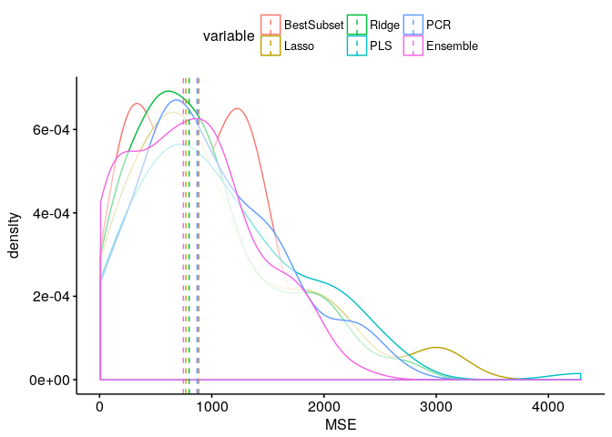

``` r
summarise(group_by(cv_error, variable), MSE = median(MSE))
```

    ## # A tibble: 6 x 2
    ##   variable     MSE
    ##   <fct>      <dbl>
    ## 1 BestSubset   885
    ## 2 Lasso        769
    ## 3 Ridge        798
    ## 4 PLS          872
    ## 5 PCR          869
    ## 6 Ensemble     747
