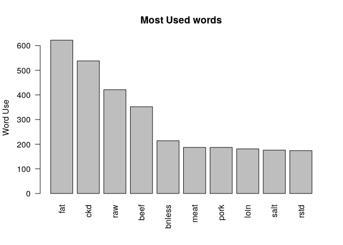
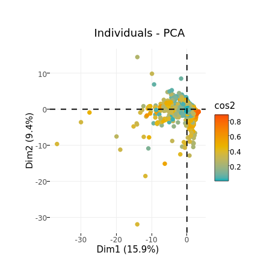

Principal Components for Exploration
================
Chase Baggett

Introduction
============

I will be exploring principal components as a method of dimension reduction primarily for exploratory purposes. The principal components being built could be plugged back into a supervised model, but I will be studying principal components as a method of unsupervised feature construction.

Data
====

The data comes from the USDA and represents by the nutrition levels of 2,223 products across 46 nutrition metrics. My goal will be to understand which of the underlying nutrition metrics might measure the same underlying latent features, and could be combined to reduce the dimensions of our dataset.

Analysis
========

Exploring the Data
------------------

Visualizing this dataset will be problematic, because of the high *p* predictors. Generating a pairs plot generates $\\frac{p(p-1)}{2}$ predictors. As we can see below, we'd need to generate 1,035 plots to do visualize the entire dataset.

``` r
pairs_size <- function(p){p*(p-1)/2}
pairs_size(ncol(SRp))
```

    ## [1] 1035

However, we do a have dataset with named rows. I'm going to make a quick word cloud of the rownames to help me better understand what appears in the data.

``` r
rows <- rownames(SRp)
words <- Corpus(VectorSource(rows))
toSpace <- content_transformer(function (x , pattern ) gsub(pattern, " ", x))
words <- tm_map(words, toSpace, ",")
doc_matrix <- TermDocumentMatrix(words)
m <- as.matrix(doc_matrix)
v <- sort(rowSums(m),decreasing=TRUE)
d <- data.frame(word = names(v),freq=v)

set.seed(1234)
wordcloud(words = d$word, freq = d$freq, min.freq = 1,
          max.words=200, random.order=FALSE, rot.per=0.35, 
          colors=brewer.pal(8, "Dark2"))
```


Then we can look at words like "fat" and hypothesize that they might be important.

``` r
barplot(d[1:10,]$freq, las = 2, names.arg = d[1:10,]$word,
        col ="gray", main ="Most Used words",
        ylab = "Word Use")
```



We can also generate plots for our most correlated measures in the underlying data, and see that we have two measures of Vitamin D that are actually perfectly correlated, and a few other near perfect correlations.

``` r
log_inf <- function(x){
  if(x==0){0}else{log(x)}
}
correlation <- melt(cor(SRp))
correlation <- subset(correlation,X1!=X2)
correlation$value <- abs(correlation$value)
correlation <- correlation[order(correlation$value,decreasing = T),]
top5_x1 <- as.character(head(correlation$X1,5))
top5_x2 <- as.character(head(correlation$X2,5))
values <- unique(c(top5_x1,top5_x2))
corr_plot_data <- log_inf(scale(SRp[,values]))
ggpairs(corr_plot_data)
```


However, from what exploratory analysis I have done two things are obvious to me, which is that we are dealing with a scenario with high collinearity of predictors, and that many of our underlying records are related to one another in non-random ways, ie, we see beef products vs chicken products, that are likely to have similar characteristics.

Principal Components
--------------------

This dataset is an excellent candidate for principal components because we can reduce the number of predictors to the underlying variability of the dataset. We shouldn't need several measures that are nearly perfectly collinear with one another.

We fit a scaled, center, PCA on the data, and see that we have 46 principal components for our 46 variables.

``` r
library(DT)
pca.model <- prcomp(SRp, scale=TRUE,center = TRUE)
dim(pca.model$rotation)
```

    ## [1] 46 46

We can generate a plot of the first two principal components with the loadings plotted as arrows.

``` r
autoplot(pca.model,alpha=.75,loadings=T)
```


We can also see that our first principal component gets us a little over 15% of variance explained, and that by 20, we are getting only 1.5% additional variance.

``` r
options(scipen=999)
ggplotly(fviz_eig(pca.model,ncp = 20))
```


However, its pretty smooth in terms of value added. There's no obvious point at which we stop gaining information.

``` r
pca_eig <- get_eig(pca.model)
ggplotly(ggplot(pca_eig,aes(x=1:46,y=cumulative.variance.percent)) + 
  geom_line() +
  ggtitle("Cumulative Variance Gains"))
```


We can also see items that behave similarly. For instance, if you hover over the band of orange in a negative sloping shape above the x axis that crosses the y axis, you will see they are mainly beef products. Due to a lack of space, the name only appears on hover.

``` r
item_name <- rownames(SRp)
sim_prod <- fviz_pca_ind(pca.model,
             col.ind = "cos2",
             gradient.cols = c("#00AFBB", "#E7B800", "#FC4E07"),
             repel = FALSE,
             geom="point"
             ) + geom_point(alpha=0,aes(Item=item_name))

ggplotly(sim_prod)
```



We can also see here that some predictors behave very similarly to others. If you zoom in on the folates, they are almost perfectly overlapped lines.

``` r
nutrient_name <- colnames(SRp)
similar_nutrients <- fviz_pca_var(pca.model,
             col.var = "contrib", 
             gradient.cols = c("#00AFBB", "#E7B800", "#FC4E07"),
             repel = FALSE,
             geom="arrow"
             ) + geom_point(alpha=0,aes(label=nutrient_name))
ggplotly(similar_nutrients)
```


Conclusion
==========

I think principal components has been very effective at helping me understand the relationships between the various predictors. If I were to continue along this analysis, I would need guidance on the objective of the analysis. If we simple wished to understand the relationship, then clustering might be more effective, but if we plan to put the components into a supervised model, that would help to identify a cut point at which to stop taking components, as we a very smooth cumulative marginal variance which doesn't provide an obvious cutoff point,
